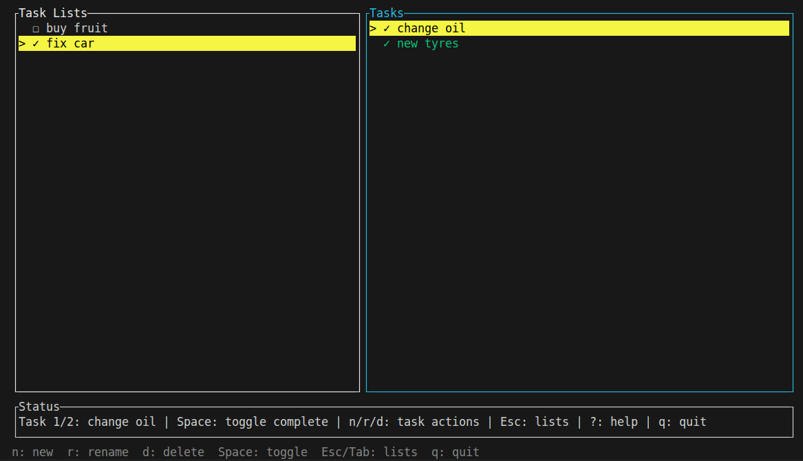

# shtask

Terminal task-list manager backed by local TOML files in `./.shtask/`.

[](https://github.com/danielemiliogarcia/sth-tasklist/actions/workflows/ci.yml)


## AI Handoff Example

This application was developed with the
[sth harness plugin](https://github.com/danielemiliogarcia/sth-harness-plugin).
The plugin keeps the project's knowledge, decisions, and current work state in a
tool-agnostic harness, making it possible to pass development between AI tools
without losing context. This project started in Claude Code, moved to Codex, and
then continued again in Claude Code.


## Run

```bash
cargo run
```

For a non-interactive startup check:

```bash
cargo run -- --headless
```

## TUI Keys

Press `?` in the app to show help for the active mode. Press `q` to quit.
The selected row is marked with `>>`, and the status line also shows the current
selection, such as `List 1/2: work` or `Task 2/3: milk`.

List mode:

- `n` new list
- `r` rename selected list
- `d` delete selected list, then `y` to confirm
- `Enter` open selected list's tasks
- `Up` / `Down` select a list; selection wraps at the top and bottom
- `Esc` closes help or cancels prompts

Task mode:

- `n` new task
- `r` rename selected task
- `d` delete selected task, then `y` to confirm
- `Space` complete selected task
- `Up` / `Down` select a task; selection wraps at the top and bottom
- `Esc` returns to List mode, closes help, or cancels prompts

Screenshot


